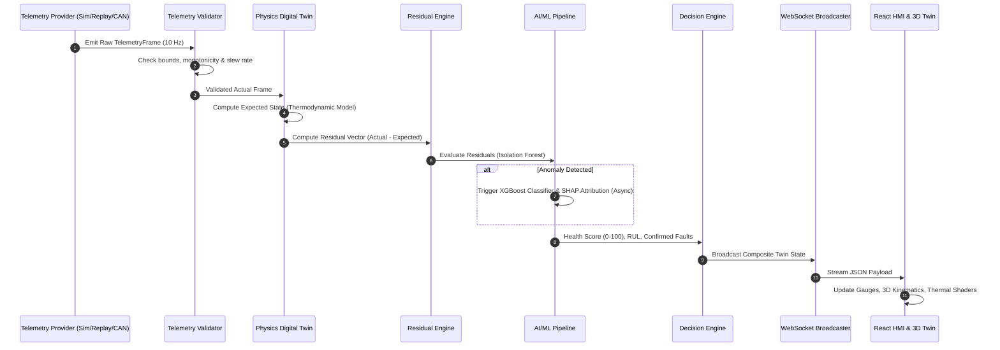

# AeroTwin AI — Architectural Specification

**Document Version**: `1.0.0`  
**System Designation**: AeroTwin AI — MALE UAV Aero-Piston Engine Digital Twin & Health Monitoring  
**Standard Compliance**: Clean Architecture / Hexagonal Architecture (Ports and Adapters)  

---

## 1. Architectural Philosophy & Core Principles

AeroTwin AI is designed as a **Modular Monolith** governed by four primary architectural tenets:

1. **Separation of Concerns & Dependency Inversion**:
   The business and physical domain logic (engine models, degradation curves, telemetry validation rules) is located at the center of the architecture and has **zero dependencies** on external frameworks, databases, or UI libraries.
2. **Ports and Adapters (Hexagonal)**:
   All external infrastructure—such as the FastAPI web server, WebSocket broadcasting layer, SQLite database, Parquet file logger, and machine learning libraries (XGBoost, Scikit-learn)—communicates with the application layer solely through strongly-typed abstract interfaces (`ports`).
3. **The Residual-Centric Digital Twin Paradigm**:
   A digital twin is not a passive telemetry dashboard. It maintains a dual state:
   - **Actual State** ($\vec{y}_t$): Measured observations from onboard sensors.
   - **Expected State** ($\hat{y}_t = f(\text{Throttle}, \text{Altitude}, \text{OAT}, \text{Airspeed}, \dots)$): The theoretical physical operating point computed by a thermodynamic model.
   - **Residual Vector** ($\vec{r}_t = \vec{y}_t - \hat{y}_t$): The deviation representing true degradation, thermal fouling, or mechanical anomaly rather than normal operating variations.
4. **Asynchronous Real-Time Pipeline**:
   The telemetry streaming path operates at a nominal 10 Hz frequency (with rate-configurability supported across all ingestion and dispatch layers) and is decoupled from heavy analytics (such as SHAP explainability or Parquet flushes) targeting sub-millisecond pipeline latency once the implementation is benchmarked.
5. **Generic Engine Baseline & Prototype Honesty**:
   The physics twin represents a generic 4-cylinder horizontally-opposed turbocharged aero-piston engine inspired by the Rotax 914/915 class. It is NOT an exact or certified manufacturer simulation; all physical parameters are documented as prototype assumptions.

---

## 2. Layered Structure

```
+-------------------------------------------------------------------------------+
|                             Presentation Layer                                |
|  - Web UI / HMI: React 18, Vite, TypeScript, Tailwind CSS, Lucide Icons      |
|  - Real-Time 3D Twin: Three.js, React Three Fiber, Drei (Kinematics & Shaders)|
|  - State Management: Zustand (Atomic telemetry & twin stores)                 |
|  - Visual Analytics: Recharts (Time-series telemetry & residual graphs)       |
+-------------------------------------------------------------------------------+
                                       ▲ (HTTP REST / WebSocket)
                                       │
+-------------------------------------------------------------------------------+
|                             Application Layer                                 |
|  - TwinOrchestrator: Manages twin lifecycle & coordinates state comparison   |
|  - DiagnosticsService: Coordinates anomaly detection, classifier, & SHAP      |
|  - MissionSimulatorService: Controls simulated flight profiles & fault inputs |
|  - MissionReplayService: Manages time-scrubber playback of recorded flights   |
|  - MaintenanceAdvisoryService: Evaluates thresholds & issues advisories      |
+-------------------------------------------------------------------------------+
                                       ▲
                                       │ (Calls Use Cases & Observes Domain)
+-------------------------------------------------------------------------------+
|                               Domain Layer                                    |
|  [PURE PYTHON - NO EXTERNAL FRAMEWORK OR DB OR ML COUPLING]                   |
|  - Entities: Engine, Cylinder, Sensor, TelemetryFrame, FaultEvent             |
|  - Value Objects: HealthIndex, ResidualVector, OperatingCondition, RULState  |
|  - Domain Services: AeroPistonThermodynamics, DegradationDynamics            |
|  - Ports (Abstract Interfaces):                                               |
|      * ITelemetryProvider (Simulated, Replay, CAN)                            |
|      * ITelemetryRepository (SQLite / Parquet storage)                       |
|      * IAnomalyDetector (IsolationForest / Statistical)                       |
|      * IFaultClassifier (XGBoost / RuleBased)                                 |
|      * IExplainabilityService (SHAP)                                          |
|      * IRULEstimator (Degradation trajectory models)                          |
+-------------------------------------------------------------------------------+
                                       ▲
                                       │ (Implements Ports)
+-------------------------------------------------------------------------------+
|                            Infrastructure Layer                               |
|  - Web & Transport: FastAPI, Uvicorn, WebSocketManager                        |
|  - Storage: SQLiteTelemetryRepository, ParquetFlightRecorder                  |
|  - Machine Learning: SklearnIsolationForest, XGBoostClassifier, ShapExplainer |
|  - Physics Simulation: AeroPiston0DModel (combustion, cooling, lubrication)  |
|  - Hardware Adapters: MockCANTelemetryProvider, FileTelemetryProvider         |
+-------------------------------------------------------------------------------+
```

---

## 3. Data Flow Diagram



---

## 4. SOLID Compliance Strategy

- **Single Responsibility (SRP)**: Each class has a single reason to change. The `TelemetryValidator` does not perform physics calculations; the `AeroPistonPhysicsEngine` does not format WebSocket messages.
- **Open/Closed (OCP)**: New anomaly detectors (e.g., autoencoders) or telemetry sources (e.g., real SocketCAN) can be introduced by implementing `IAnomalyDetector` or `ITelemetryProvider` without modifying existing orchestration code.
- **Liskov Substitution (LSP)**: Any `ITelemetryProvider` implementation (simulated, file replay, CAN bus) can be swapped in the application container transparently.
- **Interface Segregation (ISP)**: Interfaces are lean and focused (`ITelemetryReader`, `ITelemetryWriter`, `IModelTrainer`, `IModelPredictor`) rather than monolithic.
- **Dependency Inversion (DIP)**: High-level application modules depend on domain abstractions (`ports`), never on low-level infrastructure modules.
