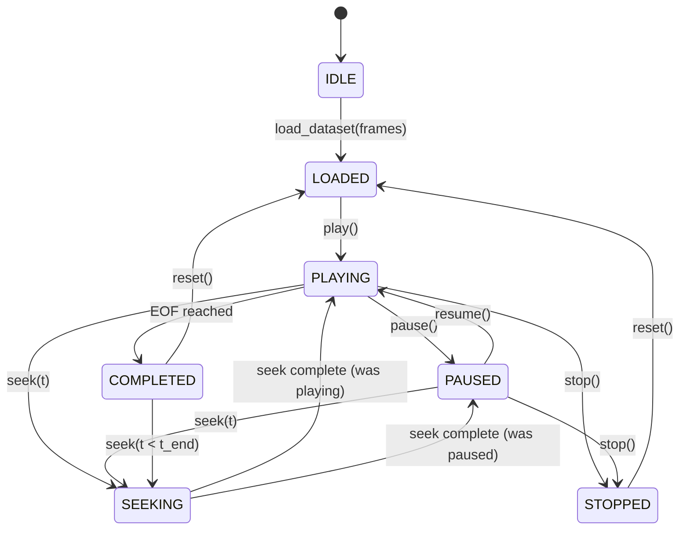

# AeroTwin AI — Flight Replay Subsystem
**Historical Playback Engine, Cursor State Machine, Timing Synchronization, and Source Switching**

**Document ID:** AT-DOC-FLIGHT-REPLAY-001  
**Project:** SIH26054 — AeroTwin AI  
**Subsystem:** Phase 8 — Mission Simulation + Flight Replay + Scenario Playback  
**Baseline Engine:** Generic 4-cylinder horizontally-opposed turbocharged aero-piston engine (Rotax 914/915 iS class)  
**Status:** IMPLEMENTED & VERIFIED  

---

> [!IMPORTANT]
> **PROTOTYPE RESEARCH DISCLAIMER**  
> The flight replay engine, log parsers, and playback controls are prototype software components designed for algorithm verification and post-test review. Replayed telemetry logs represent simulated mission traces or bench recordings; this subsystem is not certified as an FAA Part 121/135 flight data recorder (FDR) analyzer or airworthiness crash-investigation tool.

---

## 1. System Overview & Architecture

The Flight Replay subsystem enables AeroTwin AI to ingest recorded telemetry datasets, scrub through mission timelines with sub-second accuracy, and feed historical data directly into the full Phase 1–7 digital twin pipeline (physics residuals, ML anomaly detection, and prognostics):

```
+---------------------------------------------------------------------------------+
|                                 LOG INGESTION LAYER                             |
|   FlightLogLoader                                                               |
|   - Formats: Parquet (.parquet), SQLite (.db, .sqlite), CSV (.csv)              |
|   - Security: Path traversal protection, strict column schema validation        |
|   - Memory Cap: Enforced 100,000 frames ceiling (~2.77 hours at 10 Hz)         |
+---------------------------------------------------------------------------------+
                                      | loads
                                      v
+---------------------------------------------------------------------------------+
|                                 REPLAY CURSOR FSM                               |
|   ReplayCursor (app.domain.replay)                                              |
|   - Deterministic FSM: IDLE -> LOADED <-> PLAYING <-> PAUSED -> COMPLETED      |
|   - Binary-search timestamp seeking: t_k <= t_target invariant                 |
|   - Boundary clamping: [0, N-1]                                                 |
+---------------------------------------------------------------------------------+
                                      | streams
                                      v
+---------------------------------------------------------------------------------+
|                             TELEMETRY SOURCE PIPELINE                           |
|   ReplayTelemetrySource (ITelemetrySource)                                      |
|   - Paced delivery with drift-compensating wall-clock timers                    |
|   - Multi-speed modes: 0.5x, 1.0x, 2.0x, 5.0x, 10.0x, and unpaced OFFLINE_BATCH |
+---------------------------------------------------------------------------------+
                                      | switches
                                      v
+---------------------------------------------------------------------------------+
|                           REALTIME BROADCAST SERVICE                            |
|   RealtimeTelemetryService                                                      |
|   - 6-Step Safe Source Switching Protocol                                       |
|   - Dual-mode broadcast: REALTIME_SIMULATION vs HISTORICAL_REPLAY               |
+---------------------------------------------------------------------------------+
```

---

## 2. Replay Cursor Finite State Machine (FSM)

The replay cursor tracks position, playback state, and timing mode through a formal FSM:



### 2.1 State Definitions
- **`IDLE`:** No dataset loaded in memory.
- **`LOADED`:** Dataset parsed and validated; cursor positioned at frame index 0.
- **`PLAYING`:** Cursor advancing sequentially according to playback speed.
- **`PAUSED`:** Playback halted at current frame index; retains position.
- **`SEEKING`:** Atomic repositioning via timestamp binary search.
- **`COMPLETED`:** End of log reached.
- **`STOPPED`:** Playback terminated by operator.

### 2.2 End-of-File (EOF) Semantics
To prevent infinite loops, buffer thrashing, or duplicate frame flooding when reaching the end of a log:
1. When `cursor_index >= total_frames`:
   - Cursor state transitions to `PlaybackState.COMPLETED`.
   - Streaming terminates (`next_frame()` returns `None`).
   - If `loop_enabled == True`, cursor wraps to frame index 0 and resumes playback.
   - If `loop_enabled == False`, the engine idles in `COMPLETED` until an explicit `reset()` or `seek()` command is received.

---

## 3. Data Time vs. Wall-Clock Time Synchronization

Replay pacing maintains faithful synchronization between the recorded dataset's time delta ($\Delta t_{\text{data}}$) and physical wall-clock time ($\Delta t_{\text{wall}}$):

$$\Delta t_{\text{wall\_target}} = \frac{t_{\text{data}}(k) - t_{\text{data}}(k-1)}{\text{speed\_multiplier}}$$

### 3.1 Execution Modes
1. **`REALTIME` (exactly $1.0\times$):** Paced at identical cadence as original log (e.g., $100\text{ ms}$ per frame for 10 Hz).
2. **`ACCELERATED` (strictly $0.5\times, 1.0\times, 2.0\times, 5.0\times, 10.0\times$):** Scaled sleep intervals using drift-compensated fractional sleeps. Arbitrary speeds and $0.25\times$ are rejected.
3. **`OFFLINE_BATCH` (unpaced):** Eliminates pacing intervals entirely; emits frames at CPU execution capacity for rapid batch evaluation, benchmark profiling, or model backtesting. Note: There is no pseudo-speed named "MAX"; unpaced execution is represented strictly via `OFFLINE_BATCH`.

---

## 4. Seeking Semantics & Timestamp Invariants

Timestamp seeking uses logarithmic binary search (`bisect_right` on strictly monotonic timestamps):

$$k^* = \max \{ k \mid t_k \le t_{\text{target}} \}$$

### 4.1 Invariants & Boundary Guards
- **Past End Guard:** If $t_{\text{target}} \ge t_{N-1}$, cursor clamps to index $N-1$ and state transitions to `COMPLETED`.
- **Prior to Start Guard:** If $t_{\text{target}} \le t_0$, cursor clamps to index $0$.
- **Causality Invariant:** Binary search guarantees that the selected frame timestamp never exceeds the requested target timestamp ($t_{k^*} \le t_{\text{target}}$).

---

## 5. Safe Source-Switching Lifecycle

Switching between live synthetic simulation (`REALTIME_SIMULATION`) and historical flight replay (`HISTORICAL_REPLAY` / `LOG_REPLAY`) follows a strict 6-step lifecycle in `RealtimeTelemetryService`:

```
Step 1: STOP
  Halt current telemetry source background ingestion task.
  Wait for active generator/coroutine loop termination.

Step 2: CLEANUP
  Drain pending frames in broadcast queue.
  Clear transient ring buffer residues to prevent cross-stream contamination.

Step 3: SET
  Assign new ITelemetrySource instance (Synthetic or Replay source).
  Update internal source_mode enum.

Step 4: RESET
  Reset physics residual calculators, ML feature buffers, and causal prognostics windows.
  Guarantee clean state for the incoming stream.

Step 5: START
  Initiate background collection task with new source.
  Initialize pacing clock.

Step 6: BROADCAST
  Broadcast source_changed event to all connected WebSocket clients with active metadata.
```

Verified in integration tests (`test_source_switching.py`): zero frame leakage, zero thread deadlocks, and clean WebSocket client transition.

---

## 6. Security & Resource Constraints

1. **Path Traversal Defense:** Datasets are strictly restricted to the application data directory (`data/` or `logs/`). Absolute paths and paths with `../` attempting directory escape are rejected with `HTTP 400 Bad Request`.
2. **Memory Ceiling:** A hard limit of 100,000 frames (~2.77 hours of 10 Hz telemetry) is enforced on all loaded files. Larger files are rejected with an explicit error to prevent server out-of-memory crashes.
3. **Monotonicity Validation:** Timestamp vectors must be strictly monotonically increasing ($t_{k} > t_{k-1}$). Any non-monotonic rows trigger schema validation rejection.
