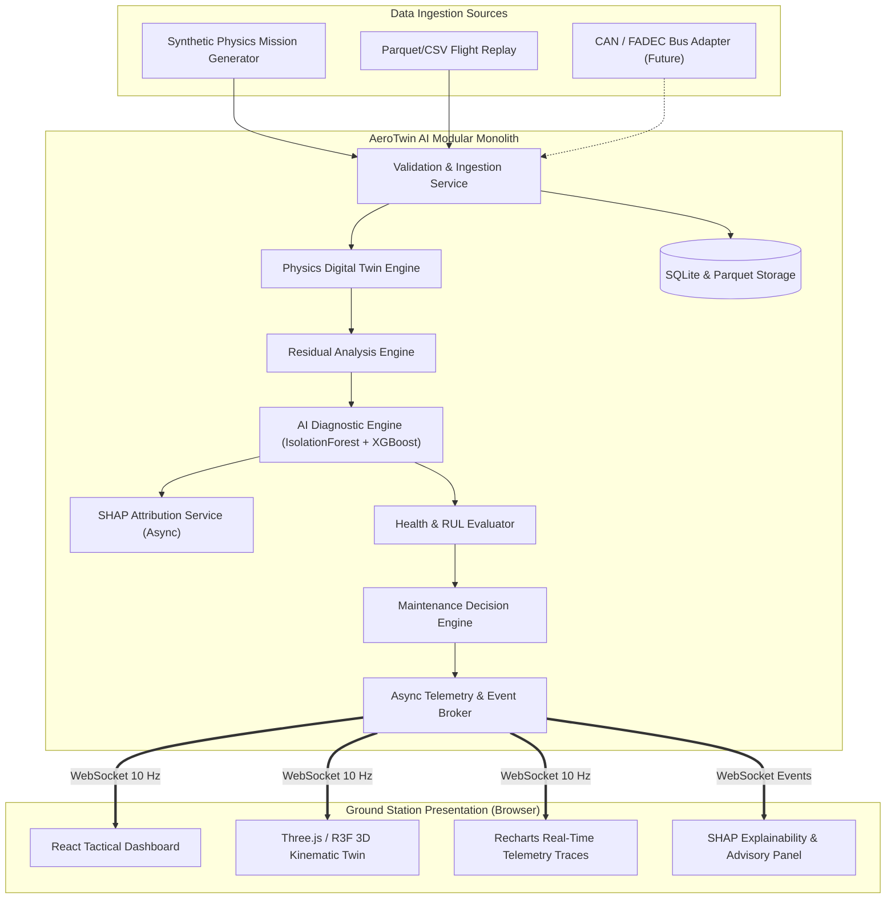

# AeroTwin AI — High-Level Design (HLD)

**Document Reference**: `AEROTWIN-HLD-001`  
**Classification**: System Architecture Specification  
**Status**: APPROVED BASELINE  

---

## 1. System Scope & Objectives

AeroTwin AI is designed to monitor the operational health of aero-piston engines used in Medium Altitude Long Endurance (MALE) Unmanned Aerial Vehicles (UAVs).

### Primary System Functions
1. **Telemetry Ingestion & Boundary Validation**: Validates real-time sensor streams at 10 Hz against aerospace physical bounds.
2. **Physics-Informed Digital Twin Simulation**: Simulates an identical virtual engine running under identical commanded conditions (throttle, altitude, OAT, airspeed) to compute nominal expected thermodynamic and mechanical states.
3. **Multivariate Residual Generation**: Computes continuous deviation vectors ($\vec{r} = \vec{y}_{\text{actual}} - \hat{y}_{\text{expected}}$) across RPM, CHT, EGT, oil pressure, oil temperature, and vibration.
4. **Machine Learning Anomaly Detection & Classification**:
   - Unsupervised Isolation Forest flags sudden and gradual anomalous residual drifts.
   - Supervised XGBoost maps residual patterns to discrete fault classes (e.g., injector clogging, cylinder misfire, oil pump cavitation, cooling baffle loss).
   - TreeSHAP computes explainable Shapley contributions for operator transparency.
5. **Degradation Tracking & Remaining Useful Life (RUL)**: Tracks progressive wear indices (thermal fatigue, piston ring blow-by, bearing friction) to project operational hours remaining before recommended overhaul.
6. **Decision & Maintenance Advisory Engine**: Generates graded alerts (INFO, ADVISORY, CAUTION, WARNING) conforming to aerospace HMI standards.
7. **Interactive 3D Ground Station HMI**: Presents an interactive 3D kinematic engine model with real-time thermal gradient vertex/fragment shaders and time-series telemetry charts.

---

## 2. System Context Diagram

---

## 3. Subsystem Breakdown

### 3.1 Telemetry Subsystem
- **Provider Interface**: `ITelemetryProvider` abstracts data sources.
- **Validation Pipeline**: Ingestion validator checks type, range, NaN/null, rate of change, and sequence continuity. Rejects corrupt frames to prevent twin pollution.

### 3.2 Digital Twin & Physics Subsystem
- **Model Type**: 0D/1D lumped-parameter thermal-fluid differential equations.
- **Coupled Sub-models**:
  - *Air induction & turbocharging*: Manifold pressure as a function of throttle, RPM, compressor map, and altitude.
  - *Combustion heat release*: Chemical energy converted to mechanical work and thermal losses.
  - *Cylinder thermal dynamics*: Convective heat transfer from combustion gas to cylinder walls, modulated by cooling airflow.
  - *Lubrication & oil heat exchanger*: Oil pressure dynamics and temperature balance with air/coolant radiators.

### 3.3 AI/ML Diagnostics Subsystem
- **Anomaly Detection**: Isolation Forest evaluated on residual features.
- **Fault Classifier**: Multi-class XGBoost classifier identifying specific failure modes.
- **Explainability**: SHAP TreeExplainer generates localized feature attributions whenever an anomaly or fault is detected.
- **Temporal Filter**: 3-frame rolling window confirmation to eliminate single-sample transient noise.

### 3.4 Presentation Subsystem
- **React 18 + Vite**: High-performance UI shell.
- **Zustand Store**: Ephemeral atomic telemetry state (updated at 10 Hz without React tree thrashing).
- **React Three Fiber (R3F)**: WebGL 3D engine assembly with real-time kinematic rotation (crankshaft, pistons, propeller) and dynamic GLSL thermal gradient shaders.
