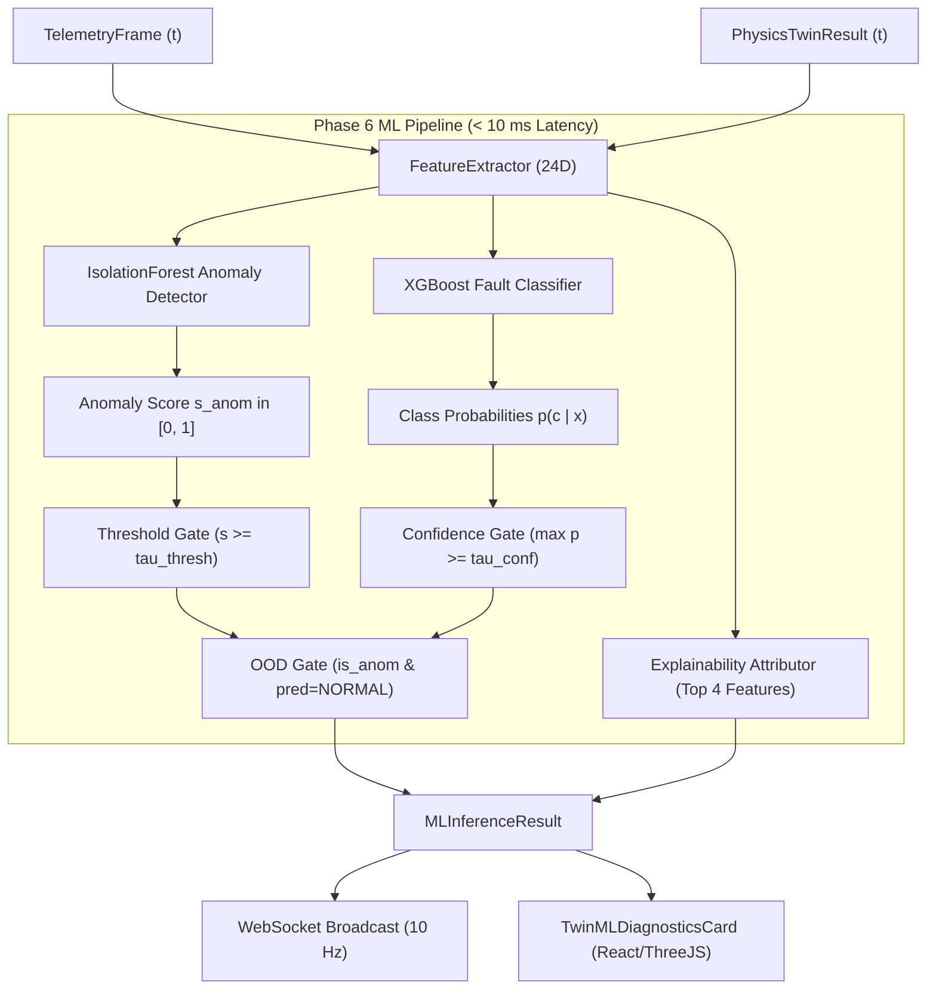

# AeroTwin AI — Phase 6: Machine Learning Architecture

## 1. System Overview & Architectural Purpose

Phase 6 implements the **AI Anomaly Detection + Fault Classification** subsystem of AeroTwin AI (SIH26054). The architecture operates as a low-latency, deterministic ML inference pipeline evaluating each incoming 10 Hz telemetry observation in conjunction with Phase 5 analytical physics residuals.

---

## 2. Ports and Adapters (Hexagonal Architecture)

The ML subsystem preserves strict domain separation and hexagonal boundaries:

* **Domain Core (`app/domain/ml/`)**:
  - `models.py`: Immutable domain entities (`AnomalyStatus`, `FaultCategory`, `DecisionReason`, `MLInferenceResult`, `FeatureContribution`).
  - `features.py`: `FeatureExtractor` building deterministic 24-dimensional feature vectors (`FEATURE_SCHEMA_VERSION = "1.0.0"`).
  - `anomaly.py`: `IAnomalyDetector` port and `IsolationForestAnomalyDetector` implementation with monotonic $[0, 1]$ severity normalization and physics residual excursion evaluation.
  - `classifier.py`: `IFaultClassifier` port and `XGBoostFaultClassifier` (with `HistGradient` fallback) enforcing confidence thresholding and Out-Of-Distribution (OOD) semantics.
  - `explainability.py`: `ExplainabilityAttributor` generating directional feature attributions in $< 0.1\text{ ms}$.

* **Application Service Layer (`app/application/services/`)**:
  - `ml_service.py`: `MLInferenceService` coordinating thread-safe, non-blocking feature extraction, anomaly evaluation, classification, and diagnostic metrics.

* **Infrastructure & Transports (`app/infrastructure/` & `app/api/`)**:
  - `websocket/protocol.py`: `TelemetryMessage` extended with `ml: MLInferenceResult | None`.
  - `routes/ml.py`: REST routes for `/api/v1/ml/status`, `/api/v1/ml/models`, `/api/v1/ml/features`, `/api/v1/ml/current`, and `/api/v1/ml/evaluate`.
  - `dependencies.py`: Singleton providers `get_ml_inference_service()` and `is_ml_ready()` integrated into health probes.

---

## 3. Decision Logic & Safety Guards

### 3.1 Confidence Threshold Gate ($\tau_{\text{confidence}} = 0.60$)
If the highest softmax probability $\max_c p_c(x) < 0.60$, the system suppresses the diagnosis and outputs `UNKNOWN` with `reason = DecisionReason.LOW_CONFIDENCE`.

### 3.2 Out-Of-Distribution (OOD) Gate
If the unsupervised anomaly detector flags an anomaly ($s_{\text{anom}} \ge \tau_{\text{threshold}}$) but the classifier predicts `NORMAL` with high confidence, the system recognizes a novel failure mode or unmodeled regime and overrides the prediction to `UNKNOWN` with `reason = DecisionReason.OUT_OF_DISTRIBUTION`.

### 3.3 Prototype Disclaimer
All payloads and endpoints output the explicit disclaimer:
`"PROTOTYPE RESEARCH MODEL — NOT FOR CERTIFIED FLIGHT OPERATIONS"`
