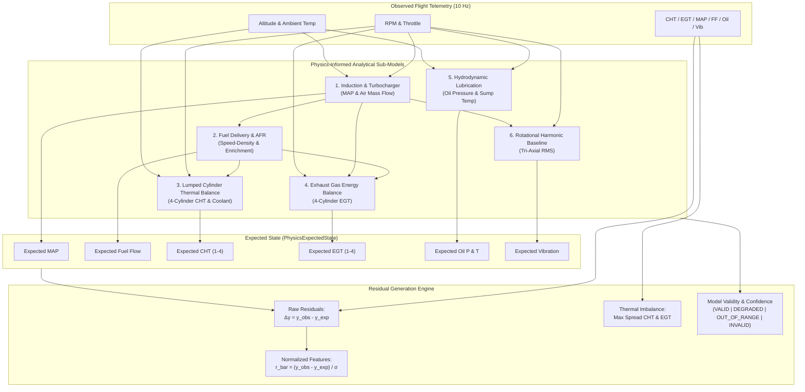

# AeroTwin AI — Physics-Informed Digital Twin (PIDT) Specification

**Document Version**: 1.0.0  
**Project**: SIH26054 — AeroTwin AI  
**Phase**: Phase 5 — Physics-Informed Digital Twin & Residual Engine  
**System Baseline**: Generic 4-Cylinder Turbocharged Aero-Piston Engine (MALE UAV, Rotax 914/915 iS Class)

---

## 1. Architectural Overview

The **Physics-Informed Digital Twin (PIDT)** operates as an analytical reference standard running alongside real-time engine telemetry. Its core responsibility is computing the **expected physical state** of the engine for any given flight condition and generating **directional residuals** comparing observed sensor measurements against first-principles expectations.

---

## 2. Invariant & Directionality Guarantees

The Residual Generation Engine enforces strict directional invariants:

$$\begin{aligned}
y_{\text{obs}} = y_{\text{exp}} &\implies r = 0.0 \\
y_{\text{obs}} > y_{\text{exp}} &\implies r > 0.0 \\
y_{\text{obs}} < y_{\text{exp}} &\implies r < 0.0
\end{aligned}$$

Where:
- **Raw Residual**: $r_{\text{raw}} = y_{\text{obs}} - y_{\text{exp}}$ (retains physical engineering units: inHg, L/h, °C, bar, g)
- **Normalized Residual**: $\bar{r} = \frac{y_{\text{obs}} - y_{\text{exp}}}{\sigma_y}$ (dimensionless standard score)

### Safe Division Guard
If any empirical scale $\sigma_y \le 10^{-6}$ or input is non-finite, the engine returns $\bar{r} = 0.0$ and logs a diagnostic warning, preventing division-by-zero exceptions.

### Non-Silent Clamping Policy
The engine **never silently clamps or truncates** extreme physical states or residuals. Large physical deviations remain mathematically unclipped. Out-of-envelope conditions transition `ModelValidity` explicitly to `OUT_OF_RANGE` or `INVALID` and reduce model `confidence`.

---

## 3. Sub-Model Descriptions & Core Equations

### 3.1 Induction & Turbocharger Pressure Model
- **Ambient Barometric Lapse (ICAO Standard Atmosphere)**:
  $$p_{\text{amb}}(h) = 29.921 \cdot \left(1 - \frac{0.0065 \cdot h}{288.15}\right)^{5.2559} \quad [\text{inHg}]$$
- **Naturally Aspirated Throttled Manifold Pressure**:
  $$p_{\text{na}} = p_{\text{amb}} \cdot (0.35 + 0.65 \cdot \alpha_{\text{norm}})$$
- **Turbocharger Boost Schedule**:
  $$\text{PR}_{\text{turbo}} = 1.0 + \left(\frac{\text{RPM} - n_{\text{spool}}}{n_{\text{rated}} - n_{\text{spool}}}\right)^{1.2} \cdot \alpha_{\text{norm}} \cdot (\text{PR}_{\text{max}} - 1.0)$$
- **Speed-Density Air Mass Flow**:
  $$\dot{m}_{\text{air}} = \left(\frac{V_d \cdot \text{RPM}}{120}\right) \cdot \rho_{\text{manifold}} \cdot \eta_v \cdot 3600 \quad [\text{kg/h}]$$

### 3.2 Fuel Delivery & Stoichiometric Consumption Model
- **Target Air-Fuel Ratio ($\text{AFR}$)**:
  $$\text{AFR} = \begin{cases}
  14.7 - (14.7 - 12.6) \cdot \frac{\alpha - 75}{25} & \alpha > 75\% \text{ (Power Enrichment)} \\
  13.5 & \text{RPM} < n_{\text{idle}} \text{ (Enriched Idle)} \\
  14.7 & \text{Nominal Stoichiometric Cruise}
  \end{cases}$$
- **Volumetric Fuel Flow**:
  $$\dot{V}_{\text{fuel}} = \frac{\dot{m}_{\text{air}}}{\text{AFR} \cdot \rho_{\text{fuel}}} \quad [\text{L/h}]$$

### 3.3 Lumped-Parameter Cylinder Thermal Balance
- **Convective Ram Air Cooling Factor**:
  $$k_{\text{cool}} = 1.0 + 0.40 \cdot \left(\frac{V_{\text{tas}}}{50}\right)^{0.8}$$
- **Equilibrium Steady-State CHT**:
  $$T_{\text{ss}, i} = T_{\text{amb}} + \frac{Q_{\text{combustion}}}{k_{\text{cool}}} \cdot \beta_i$$
- **Discrete Exponential Recurrence**:
  $$T_i(t + \Delta t) = T_{\text{ss}, i} + \left(T_i(t) - T_{\text{ss}, i}\right) \cdot e^{-\Delta t / \tau_{\text{cht}}}$$

### 3.4 Exhaust Gas Enthalpy Balance (EGT)
- **Equilibrium Temperature**:
  $$T_{\text{egt\_ss}, i} = \left(550 + 220 \cdot \frac{p_{\text{map}}}{29.92} \sqrt{\frac{\dot{V}_{\text{fuel}}}{16.0}} - 4.5 \cdot (\theta_{\text{inj}} - 24^\circ)\right) \cdot \beta_{\text{egt}, i}$$
- **Thermocouple Exponential Lag**:
  $$T_{\text{egt}, i}(t + \Delta t) = T_{\text{egt\_ss}, i} + \left(T_{\text{egt}, i}(t) - T_{\text{egt\_ss}, i}\right) \cdot e^{-\Delta t / \tau_{\text{egt}}}$$

### 3.5 Hydrodynamic Lubrication & Oil Temperature
- **Positive-Displacement Pump Delivery**:
  $$p_{\text{pump}} = 2.0 + 3.0 \cdot \left(\frac{\text{RPM} - n_{\text{idle}}}{n_{\text{rated}} - n_{\text{idle}}}\right) \quad [\text{bar}]$$
- **Viscosity Clearance Leakage**:
  $$p_{\text{oil}} = \min\left(5.0, \max\left(0.5, p_{\text{pump}} - 0.020 \cdot (T_{\text{oil}} - 85^\circ\text{C})\right)\right)$$

### 3.6 Rotational Harmonic Vibration Baseline
- **Harmonic Unbalance Scaling**:
  $$\text{RMS}_{\text{exp}} = 0.35 + 0.75 \cdot \left(\frac{\text{RPM}}{n_{\text{rated}}}\right)^2 + 0.35 \cdot \left(\frac{p_{\text{map}}}{29.92}\right) \quad [\text{g}]$$

---

## 4. Empirical Baseline Calibration ($\sigma$ Scales)

Empirical normalization scales are derived from steady-state cruise noise standard deviations in the Phase 2 baseline flight dataset:

| Channel | Parameter | Physical Unit | Empirical $\sigma$ Scale |
| :--- | :--- | :--- | :--- |
| `rpm` | Crankshaft Speed | RPM | $45.0\text{ RPM}$ |
| `manifold_pressure` | Manifold Absolute Pressure | inHg | $0.65\text{ inHg}$ |
| `fuel_flow` | Fuel Consumption Rate | L/h | $0.55\text{ L/h}$ |
| `cht` | Cylinder Head Temperature | °C | $3.50\text{ }^\circ\text{C}$ |
| `egt` | Exhaust Gas Temperature | °C | $14.20\text{ }^\circ\text{C}$ |
| `coolant_temp` | Coolant Jacket Temperature | °C | $2.20\text{ }^\circ\text{C}$ |
| `oil_temperature` | Sump Oil Temperature | °C | $2.80\text{ }^\circ\text{C}$ |
| `oil_pressure` | Main Gallery Oil Pressure | bar | $0.28\text{ bar}$ |
| `vibration_rms` | Tri-Axial Vibration RMS | g | $0.22\text{ g}$ |

---

## 5. Performance Benchmark Results

Measured across 980 consecutive flight frames in test execution:
- **Average Compute Latency**: $0.0375\text{ ms}$ (Target: $< 1.000\text{ ms}$)
- **95th Percentile Latency**: $0.0600\text{ ms}$
- **Maximum Frame Latency**: $0.2328\text{ ms}$
- **Throughput**: $> 26,000\text{ evaluations/sec}$
