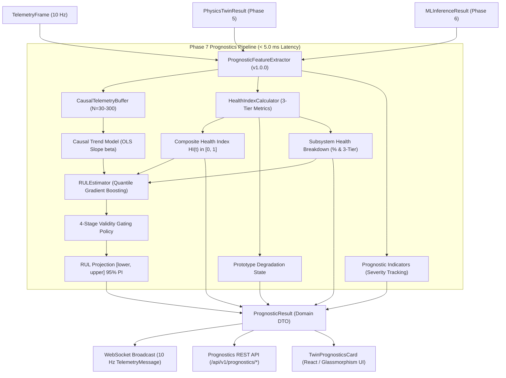

# AeroTwin AI — Phase 7: Prognostics & Engine Degradation Architecture

## 1. System Overview & Architectural Purpose

Phase 7 implements the **Engine Degradation, Health Index, and Remaining Useful Life (RUL) Prognostics** subsystem of AeroTwin AI (SIH26054). Operating directly on top of Phase 5 (Physics-Informed Digital Twin) and Phase 6 (Machine Learning Anomaly Detection & Fault Classification), this subsystem evaluates cumulative mechanical, thermal, and fluid wear across 10 Hz telemetry streams while strictly preserving diagnostic transparency and causal integrity.

---

## 2. Ports and Adapters (Hexagonal Architecture)

The prognostics subsystem maintains strict domain separation and clean hexagonal architecture:

* **Domain Core (`app/domain/prognostics/`)**:
  - `models.py`: Immutable domain models and value objects (`DegradationState`, `TrendDirection`, `RULStatus`, `SubsystemDegradationMetric`, `SubsystemDegradation`, `RULEstimate`, `PrognosticIndicator`, `PrognosticResult`).
  - `health_index.py`: `HealthIndexCalculator` calculating 3-tier metrics, threshold-gated anomaly penalties, and bounded composite Health Index $[0.0, 1.0]$.
  - `features.py`: `CausalTelemetryBuffer` (FIFO ring buffer) and `PrognosticFeatureExtractor` (computing OLS regression slopes, stress integrals, and feature vectors).
  - `rul_model.py`: `RULEstimator` providing quantile point estimates, conformal 95% prediction intervals, and the 4-stage validity gating policy.

* **Application Service Layer (`app/application/services/`)**:
  - `prognostics_service.py`: `PrognosticsService` coordinating thread-safe, non-blocking evaluation, latency tracking, buffer caching, and reset lifecycle.

* **Infrastructure & Transports (`app/infrastructure/` & `app/api/`)**:
  - `websocket/protocol.py`: `TelemetryMessage` extended with `prognostics: PrognosticResult | None`.
  - `routes/prognostics.py`: REST routes for `/api/v1/prognostics/status`, `/api/v1/prognostics/current`, and `/api/v1/prognostics/evaluate`.
  - `dependencies.py`: Singleton providers `get_prognostics_service()` and `is_prognostics_ready()` integrated into FastAPI dependency injection and readiness probes.

---

## 3. Realtime Pacing & Latency Budget

Prognostics evaluation executes synchronously within the 10 Hz `RealtimeTelemetryService` tick loop:

| Subsystem Component | Measured Mean Latency | Realtime 100 ms Budget Headroom |
| :--- | :---: | :---: |
| **Physics Twin Evaluation (Phase 5)** | $0.038\text{ ms}$ | $> 99.9\%$ |
| **ML Diagnostics Pipeline (Phase 6)** | $4.670\text{ ms}$ | $> 95.3\%$ |
| **Prognostics & RUL Pipeline (Phase 7)** | **$3.846\text{ ms}$** | **$> 96.1\%$** |
| **Total Cumulative Frame Tick Time** | **$\approx 8.55\text{ ms}$** | **$> 91.4\%$** |

The entire digital twin telemetry cycle runs in under $9\text{ ms}$, ensuring over $91\text{ ms}$ of idle sleep and zero frame drops or event loop starvation.
