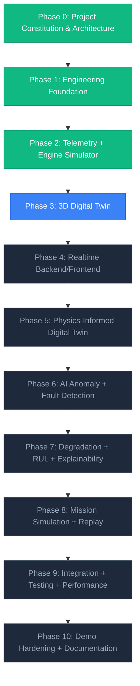

# AeroTwin AI — Implementation Roadmap & Phase Master Register

**Document Version:** 1.0.0  
**Status:** Approved Implementation Sequence  
**Current Milestone:** Phase 2 Complete, Phase 3 Pending Approval  

---

## 1. Approved 10-Phase Sequence

The development lifecycle for AeroTwin AI follows a strictly sequential 10-phase delivery plan.
Each phase has unambiguous entry/exit criteria and must be independently reviewed and approved before the subsequent phase commences.

---

## 2. Phase Detail & Responsibility Matrix

### Phase 0 — Project Constitution, Environment Audit & Architecture Gate
- **Status:** **COMPLETE & APPROVED**
- **Core Scope:** Repository structure, dependency pinning, Clean/Hexagonal Architecture blueprint, initial documentation suite (`ARCHITECTURE.md`, `HLD.md`, `LLD.md`, `DECISIONS.md` ADR-001–010), and environment verification.

### Phase 1 — Production-Style Engineering Foundation
- **Status:** **COMPLETE & APPROVED**
- **Core Scope:** Pure domain entities with AST boundary checks, application ports, centralized exception sanitization, request correlation ID middleware, and React/Tailwind ground station shell with reusable tactical UI primitives.

### Phase 2 — Telemetry + Engine Simulator
- **Status:** **COMPLETE & APPROVED**
- **Core Scope:** Deterministic engine simulator for generic 4-cylinder horizontally-opposed turbocharged aero-piston baseline, 23+ channel schema (`TelemetryFrame`), 5-tier validation (`TelemetryValidator`), sensor fault injection (`BIAS`, `DRIFT`, `STUCK`, `DROPOUT`, `NOISE_SPIKE`), SQLite repository, PyArrow Parquet logging, and simulation management REST endpoints.

### Phase 3 — 3D Digital Twin
- **Status:** **PENDING INITIATION**
- **Core Scope:**
  - Interactive Three.js / WebGL / React Three Fiber engine visualization.
  - Horizontally-opposed 4-cylinder spatial layout with crankcase, cylinders, manifolds, and turbocharger housing.
  - Dynamic rotational kinematics linked to engine RPM.
  - Component-level thermal shader heatmaps (real-time CHT and EGT gradients across Cylinders 1–4).
  - Exploded view inspection, camera orbit/pan/zoom, and subsystem focus modes.

### Phase 4 — Realtime Backend/Frontend
- **Status:** PLANNED
- **Core Scope:**
  - Asynchronous WebSocket telemetry streaming server.
  - Client-side WebSocket state synchronizer in Zustand.
  - Real-time gauge cluster, dynamic flight instruments, and rolling strip-charts.
  - Connection lifecycle management, automatic reconnect, and rate adaptation.

### Phase 5 — Physics-Informed Digital Twin
- **Status:** PLANNED
- **Core Scope:**
  - Physics-informed 0D/1D thermodynamic baseline estimator.
  - Expected operating state calculation $\hat{y}_t = f(\text{Throttle}, \text{Altitude}, \text{OAT}, \text{Airspeed}, \dots)$.
  - Real-time residual vector generator ($\vec{r}_t = \vec{y}_t - \hat{y}_t$).
  - Residual normalization and drift compensation.

### Phase 6 — AI Anomaly + Fault Detection
- **Status:** PLANNED
- **Core Scope:**
  - Unsupervised anomaly detection on residual vectors (Isolation Forest / Statistical Mahalanobis).
  - Supervised multi-class fault classification (XGBoost).
  - Synthetic fault training dataset generation and model artifact management.
  - Cross-validation and ROC-AUC benchmarking.

### Phase 7 — Degradation + RUL + Explainability
- **Status:** PLANNED
- **Core Scope:**
  - Explainable AI (SHAP value attribution of fault indicators).
  - Component degradation tracking (piston ring wear, valve fouling, cooling degradation).
  - Remaining Useful Life (RUL) estimation algorithms.
  - Automated maintenance advisory generation with confidence scores.

### Phase 8 — Mission Simulation + Replay
- **Status:** PLANNED
- **Core Scope:**
  - Flight mission profile manager (standard surveillance, loiter, stress profiles).
  - Historical flight data scrubber and time-travel replay engine.
  - Speed multipliers ($0.5\times$, $1\times$, $2\times$, $5\times$, $10\times$).
  - Mission log export and import in standard Parquet/JSON formats.

### Phase 9 — Integration + Testing + Security + Performance
- **Status:** PLANNED
- **Core Scope:**
  - End-to-end integration across all subsystems.
  - Comprehensive automated integration and regression suites.
  - System performance profiling and sub-millisecond pipeline latency verification.
  - Security audit and input sanitization hardening.

### Phase 10 — Demo Hardening + Documentation
- **Status:** PLANNED
- **Core Scope:**
  - UI polish and high-contrast tactical dark theme fine-tuning.
  - Ground station operator user manual and deployment guides.
  - Standalone presentation demonstration scripts and guided walkthroughs.
  - Final sign-off and project delivery.
