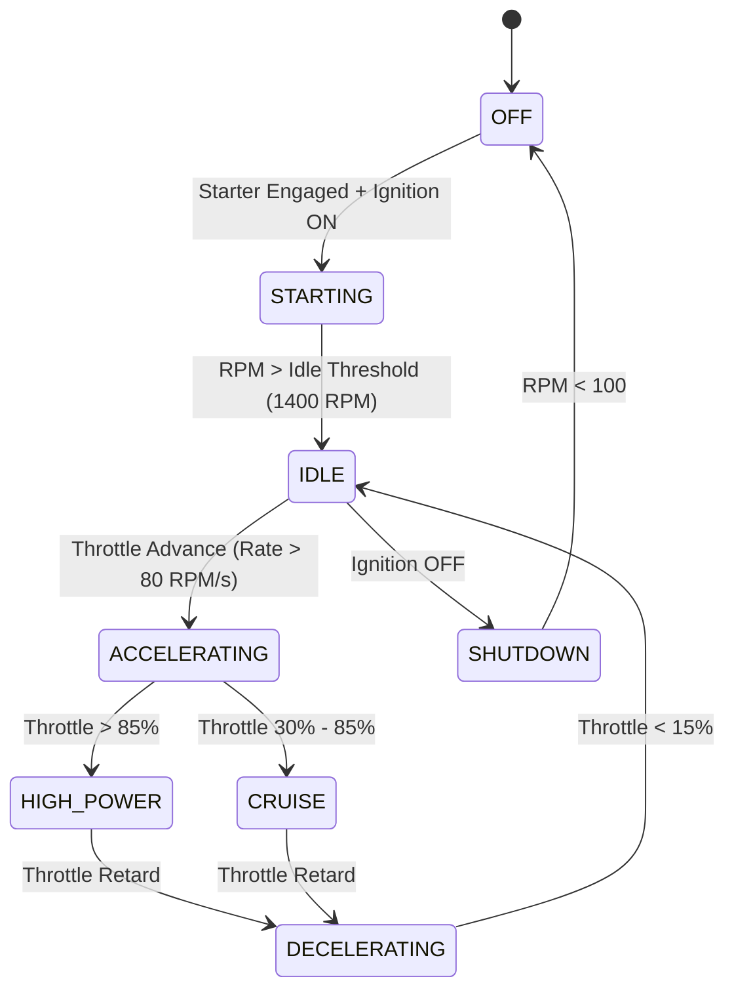

# AeroTwin AI — Engine Simulator Specification & Assumption Register

**Document Version:** 1.0.0  
**Phase Status:** Phase 2 Complete  
**Engine Baseline:** Generic 4-cylinder horizontally-opposed turbocharged aero-piston engine inspired by the Rotax 914/915 class  

---

## 1. Prototype Disclaimer & Baseline Definition

> [!IMPORTANT]
> **Prototype Simulation Baseline:**
> The simulation dynamics, thermodynamic lags, and empirical relationships implemented in AeroTwin AI represent **simplified prototype engineering approximations** for a generic 4-cylinder horizontally-opposed turbocharged aero-piston engine inspired by the Rotax 914/915 class.
>
> They do **NOT** represent OEM-certified aerospace performance data, Rotax-proprietary specifications, or certified flight training models. All parameters must be interpreted within the context of synthetic telemetry generation and AI diagnostic research.

---

## 2. Physical Dynamics & Assumption Register

The table below catalogs every physical dynamic model implemented in `EngineSimulator` (`app/infrastructure/simulation/engine_simulator.py`), the governing differential equation / approximation, and its prototype rationale.

| Subsystem | Variable | Governing Dynamic Equation / Approximation | Time Constant ($\tau$) / Rate Limit | Prototype Modeling Rationale |
| :--- | :--- | :--- | :--- | :--- |
| **Throttle Actuation** | $\theta(t)$ | $\frac{d\theta}{dt} = \text{clamp}\left(\frac{\theta_{target} - \theta}{\Delta t}, -80, +80\right)\%/s$ | Slew rate clamped to $80\%/s$ | Models servo actuator rate limit for UAV throttle body. |
| **Rotational Dynamics** | $\text{RPM}(t)$ | $\frac{d\text{RPM}}{dt} = \frac{1}{\tau_{rpm}} (\text{RPM}_{target} - \text{RPM})$ | $\tau_{rpm} = 0.6\text{ s}$ | Flywheel, crankshaft, and propeller aerodynamic inertia lag. |
| **Manifold Pressure** | $\text{MAP}(t)$ | $\text{MAP} = P_{amb} + \text{Boost} \cdot \left(\frac{\text{RPM}}{5800}\right) \cdot \left(\frac{\theta}{100}\right)^{1.3}$ | $\tau_{turbo} = 0.4\text{ s}$ | Turbocharger spool-up lag and pressure rise over barometric ambient $P_{amb}$. |
| **Fuel Delivery** | $\dot{m}_f(t)$ | $\dot{m}_f = \text{BSFC} \cdot P_{shaft} \propto \text{MAP} \cdot \text{RPM} \cdot \theta$ | Immediate + $0.2\text{ s}$ lag | Proportional to volumetric air displacement and boost level. |
| **Fuel Pressure** | $P_{fuel}(t)$ | $P_{fuel} = P_{base} + \text{MAP}_{bar} \cdot 0.35$ | Immediate rail response | Fuel pressure regulator maintains constant differential over manifold pressure. |
| **Exhaust Gas Temp** | $\text{EGT}_i(t)$ | $\frac{d\text{EGT}_i}{dt} = \frac{1}{\tau_{egt}} (\text{EGT}_{target} - \text{EGT}_i)$ | $\tau_{egt} = 1.2\text{ s}$ | Low thermal mass of exhaust gases and thermocouple probe sheath response. |
| **Cylinder Head Temp** | $\text{CHT}_i(t)$ | $\frac{d\text{CHT}_i}{dt} = \frac{1}{\tau_{cht}} (\text{CHT}_{target} - \text{CHT}_i)$ | $\tau_{cht} = 14.0\text{ s}$ | High thermal mass of aluminum cylinder head casting and cooling airflow. |
| **Coolant Temperature**| $T_{coolant}(t)$ | $\frac{dT_{coolant}}{dt} = \frac{1}{\tau_{cool}} (\overline{\text{CHT}} \cdot 0.75 - T_{coolant})$ | $\tau_{cool} = 16.0\text{ s}$ | Liquid jacket cooling loop convection and radiator dissipation. |
| **Oil Temperature** | $T_{oil}(t)$ | $\frac{dT_{oil}}{dt} = \frac{1}{\tau_{oil}} (T_{oil,target} - T_{oil})$ | $\tau_{oil} = 35.0\text{ s}$ | Heavy thermal inertia of oil sump volume and oil cooler airflow. |
| **Oil Pressure** | $P_{oil}(t)$ | $P_{oil} = f(\text{RPM}) \cdot (1.0 - \beta (T_{oil} - 80^\circ\text{C}))$ | $\tau_{oil,p} = 0.5\text{ s}$ | Positive function of engine-driven positive displacement pump speed; viscosity thinning at high temperatures. |
| **Mechanical Vibration**| $V_{rms}(t)$ | $V_{rms} = V_{base} + \gamma \cdot \left(\frac{\text{RPM}}{5000}\right)^2$ | $\tau_{vib} = 0.2\text{ s}$ | Unbalanced inertial forces scale with the square of crankshaft angular velocity. |
| **Electrical System** | $V_{bus}, I_{alt}$ | Alternator cuts in at $>1,800\text{ RPM}$; charges 28.2V bus | Regulated state machine | Alternator regulator cut-in thresholds and battery buffering. |

---

## 3. Operating State Machine

The engine transitions between 8 discrete operational states (`EngineOperatingState`):

---

## 4. Standard Flight Scenarios

AeroTwin AI includes a catalog of reproducible standard scenarios (`app/domain/simulation/scenarios.py`):

1. **`ENGINE_START`** (15.0 s): Cold pre-start, starter cranking (2.0s), ignition catch, and idle stabilization.
2. **`IDLE`** (20.0 s): Low-power thermal stabilization at ground idle.
3. **`TAXI`** (30.0 s): Low-speed ground maneuvering at 20% throttle.
4. **`TAKEOFF`** (40.0 s): Full power (100% throttle, 5,800 RPM, max boost, max fuel flow).
5. **`CRUISE`** (120.0 s): Steady-state cruise at 65% power, 3,500m ASL, 45 m/s TAS.
6. **`THROTTLE_TRANSIENTS`** (40.0 s): Rapid step-throttle cycling between 30% and 90% power to stress transient dynamics.
7. **`DECELERATION`** (35.0 s): Descent and approach power reduction (25% throttle).
8. **`ENGINE_SHUTDOWN`** (20.0 s): Cool-down idle, ignition cut, and mechanical spin-down.
9. **`COMPLETE_FLIGHT_PROFILE`** (320.0 s): Full mission flight profile chaining all scenarios sequentially.

---

## 5. Architectural Alignment (Clean Architecture)

Following the project constitution:
- **Domain Layer (`app/domain/simulation/`):** Contains scenario definitions (`scenarios.py`), fault specifications (`faults.py`), internal continuous state data structures (`state.py`), and validation rules (`validation.py`). It has **zero framework imports** (enforced by AST boundary tests).
- **Application Layer (`app/application/ports/`):** Defines clean abstract interfaces `ITelemetrySource` and `ITelemetryRepository`.
- **Infrastructure Layer (`app/infrastructure/simulation/`):** Contains the stateful concrete `EngineSimulator`, seeded PRNG noise generation (`noise.py`), and storage adapters (`telemetry_repository.py`).

---

## 6. Performance & Benchmark Results

Throughput benchmark results measured with `tests/benchmark/test_simulator_benchmark.py`:
- **Throughput:** **6,568.4 samples/second**
- **Per-Sample Compute Time:** **152.24 µs / sample**
- **Real-Time Factor:** **656x faster than real-time 10 Hz**

> [!NOTE]
> **Sub-millisecond Latency Status:**
> Sub-millisecond pipeline latency ($< 1.0\text{ ms}$) is designated strictly as a **performance target** for the complete end-to-end telemetry $\rightarrow$ Digital Twin $\rightarrow$ AI diagnostic pipeline in future phases.
> In Phase 2, the simulator engine generates single frames in $\approx 152\ \mu\text{s}$, well within the budget required to support future end-to-end pipeline goals.
